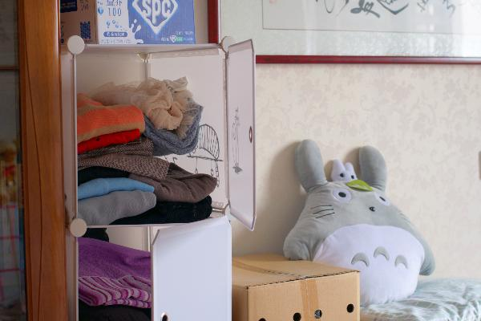

## [STATUS - ACTIVE]
## [CB] - Evaluating Copy-Blend Augmentation for Low Level Vision Tasks
Pytorch implementation.

#
### To-Do List  

- [] Paper Link
- [] Training Code
- [] Trained Models
- [] Citation

#
### Different Augmentation Techniques 
| |  |  | |  |  | |
|:---:|:---:|:---:|:---:|:---:|:---:|:---:|
| Input | Cut Mix | Cut Out | Mix-Up | Cut Blur | Copy Blend | GT |


# Results on Low Light Image Enhancement Algorithms (PSNR / SSIM / NIQE)

| | | |
|:---:|:---:|:---:|
| Input (4.65 / 0.08 / 5.29) | DLN (15.21 / 0.70 / 2.67) | AFNet (21.59 / 0.81 / 2.67) |
| | | |
| GT | DLN + CB (18.88 / 0.84 / 3.28) | AFNet + CB (23.38 / 0.89 / 3.18)|

# Results on Image Dehazing Algorithms
| |  |  |
|:---:|:---:|:---:|
| Input (6.34 / 0.19 / 4.85) | MSNet (15.62 / 0.34 / 3.83) | DIDH (16.57 / 0.34 / 3.99) |
| |  |  |
| GT | MSNet + CB (16.08 / 0.32 / 4.41) | DIDH + CB (16.56 / 0.34 / 3.98) |

# Results on Image Deblurring Algorithms
| |  |  |
|:---:|:---:|:---:|
| Input (25.01 / 0.80 / 3.83) | DeblurGANv2 (26.60 / 0.84 / 3.45) | DMPHN (25.75 / 0.82 / 3.73) |
| |  |  |
| GT | DeblurGANv2 + CB (41.93 / 0.99 / 2.66) | DMPHN + CB (34.71 / 0.96 / 2.52) |


#
### Dependencies and Installation

* python=3.8
* PyTorch=1.6
* tqdm
* numpy
* matplotlib
* PIL
* Matlab (For NIQE)
* OpenCV=4.4
* [albumentations](https://github.com/albumentations-team/albumentations)
* [piq](https://github.com/photosynthesis-team/piq)

#
## MODEL ZOO - Checkpoints of Evaluated Networks on different datasets
&nbsp;

### Task - Single Image Dehazing - [Trained Models]()
| Model  | [Ntire-19](https://data.vision.ee.ethz.ch/cvl/ntire19//dense-haze/) | [Ntire-20](https://competitions.codalab.org/competitions/22236) | 
|--------|:------------:|:------------:|
| MSNet        |  13.32 / 0.53 / 4.21 | 12.04 / 0.50 / 4.08 |
| MSNet + CB   |  14.71 / 0.58 / 3.87 | 13.97 / 0.57 / 3.77 | 
| DIDH         |  15.71 / 0.54 / 4.71 | 14.71 / 0.45 / 5.34 |
| DIDH + CB    |  17.18 / 0.62 / 3.47 | 18.16 / 0.69 / 3.28 |
&nbsp;

### Task - Low Light Image Enhancement - [Trained Models]()
|  Model        |[Retinex](https://daooshee.github.io/BMVC2018website) | [SICE](https://github.com/csjcai/SICE) |
|--------|:------------:|:------------:| 
| DLN         | 21.34 / 0.82 / 3.05 | 16.44 / 0.60 / 2.32 |  
| DLN + CB    | 21.47 / 0.84 / 2.84 | 16.51 / 0.62 / 2.37 |  
| AFNet       | 20.17 / 0.81 / 3.17 | 18.75 / 0.64 / 2.42 |  
| AFNet + CB  | 20.84 / 0.84 / 2.73 | 18.91 / 0.65 / 2.49 |  
&nbsp;

### Task - Deblurring - [Trained Models]()
|  Model        |[GO PRO]() | [Real Blur]() |
|--------|:------------:|:------------:| 
| DeblurGANv2       | 29.55 / 0.93 / 3.13 | 28.70 / 0.86 / 3.49 |  
| DeblurGANv2 + CB  | 29.91 / 0.93 / 3.07 | 31.26 / 0.92 / 3.19 |  
| DMPHN             | 30.21 / 0.93 / 2.64 | 29.71 / 0.93 / 2.76 |  
| DMPHN + CB        | 30.21 / 0.94 / 2.73 | 31.18 / 0.94 / 2.50 |  
&nbsp;

#
### Performance Evaluation with Prior Local Region based Augmentations : 

| Evalaution Dataset | Retinex | NTIRE-19 | GO PRO |
|--------|:----------:|:----------:|:----------:|
| Baseline       | 21.33 / 0.81 | 13.32 / 0.53 | 29.55 / 0.93 |
| [Cut Mix]()    | 20.78 / 0.83 | 13.51 / 0.54 | 29.17 / 0.91 |
| [Mix Up]()     | 20.57 / 0.81 | 13.05 / 0.49 | 29.23 / 0.91 |
| [Cut Blur]()   | 21.39 / 0.83 | 13.77 / 0.60 | 29.99 / 0.94 |
| [Cut out]()    | 21.42 / 0.85 | 13.75 / 0.58 | 29.51 / 0.92 |
| Copy Blend     | 21.47 / 0.84 | 14.27 / 0.62 | 29.91 / 0.93 |
&nbsp;

#
## Execution Scripts for experiments
Fig 1
```shell
python fig1_exp.py
```

Fig 4
```shell
python fig4_exp.py
```

Fig 5
```shell
python fig5_exp.py
```

Eval All
```shell
python eval_all.py
```
#
### Citation
To be determined 

If you use our work in your research, please cite our paper:
```
@article{,
  title={Evaluating Copy-Blend Augmentation for Low Level Vision Tasks},
  author={Shyam, Pranjay and Sengar, Sandeep Singh and Yoon, Kuk-Jin and Kim, Kyung-Soo},
  journal={arXiv preprint arXiv:},
  year={2021}
}
```

